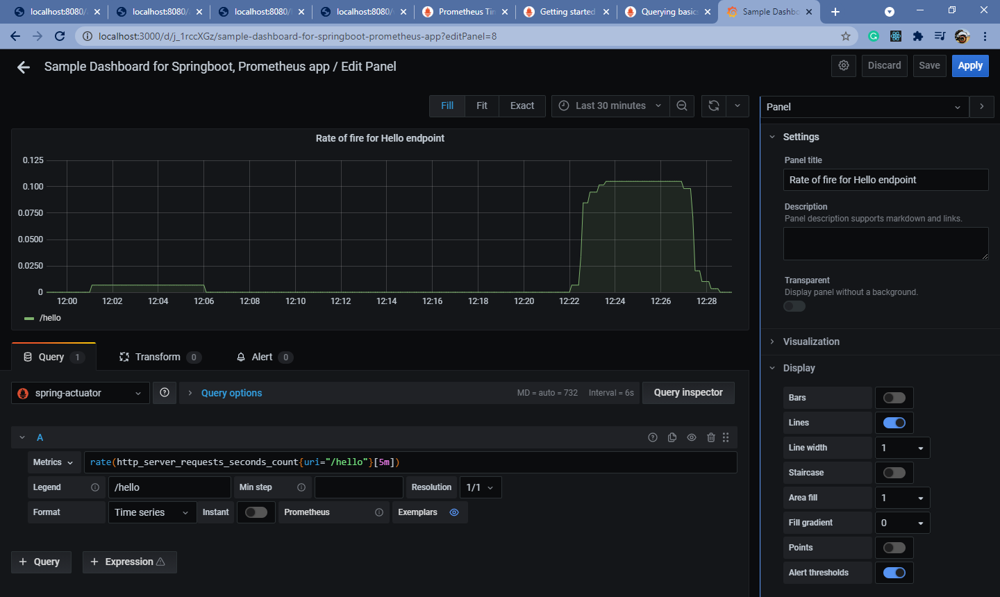

Prometheus:
docker run -d --name=prometheus -p 8080:8080 -v <PATH_FOR_PROMETHEUS_XML_FILE/prometheus.yml>:/etc/prometheus/prometheus.yml prom/prometheus --config.file=/etc/prometheus/prometheus.yml

Grafana:
docker run -d --name=grafana -p 3000:3000 grafana/grafana

	
URLs:
For all actuator links:
http://localhost:8080/actuator

For Prometheus :
http://localhost:8080/actuator/prometheus

Sample API:
http://localhost:8080/hello

Sample API with random delays to show variation in on Grafana
http://localhost:8080/waitforhello

Screenshots:
1. Prometheus dashboard with cpu usage:

2. Rate of fire of /hello API : 

3. CPU usage:

4. jvm memory usage:

